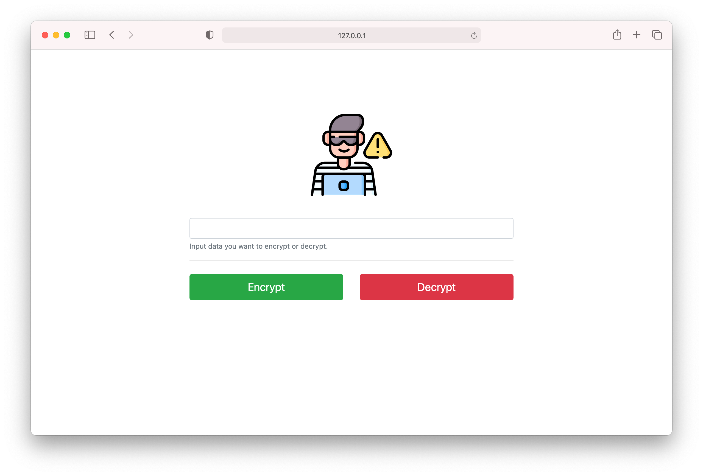

# encryptah
This is a two-tier application written in Go (backend) and Python (frontend). It takes in a user's input string and encrypts it with an AES-256 key and returns back the ciphertext.



## Build Docker Images Manually
```bash
# build the docker image for the backend
$ docker build --tag jacobmammoliti/encrypter-be:0.1 src/backend/

# push it to dockerhub
$ docker push jacobmammoliti/encrypter-be:0.1

# build the docker image for the frontend
$ docker build --tag jacobmammoliti/encrypter-fe:0.1 src/frontend/

# push it to dockerhub
$ docker push jacobmammoliti/encrypter-fe:0.1
```

## Deploy to Kubernetes
```bash
# deploy the backend
$ kubectl apply -f kubernetes/encrypter-be.yaml
serviceaccount/encrypter-fe-sa created
pod/encrypter-be created
service/encrypter-be created

# deploy the frontend
$ kubectl apply -f kubernetes/encrypter-fe.yaml
serviceaccount/encrypter-fe-sa unchanged
pod/encrypter-fe created
service/encrypter-fe created
```